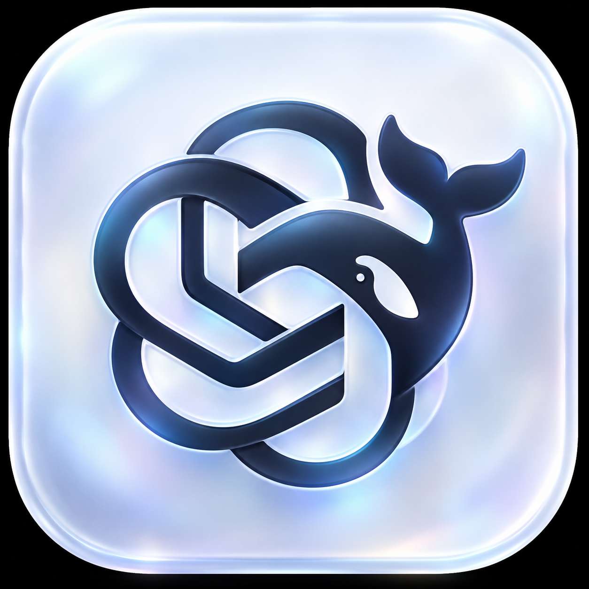

<p align="center">
  <a href="https://github.com/Chiyang001"></a>
  
  
</p>

<h1 align="center">Codsh</h1>
<p align="center"><strong>给 DeepSeek Harness 换上 Codex 风格的界面</strong></p>
<p align="center">紧凑侧栏 · 细腻动效 · 独立推理滑杆 · 更顺手的会话管理</p>
<p align="center">
  <a href="#快速安装">快速安装</a> ·
  <a href="#功能一览">功能一览</a> ·
  <a href="https://github.com/Chiyang001/dsh-codsh-theme/issues">反馈问题</a> ·
  <a href="https://space.bilibili.com/404891612">开发者 Bilibili</a>
</p>

---

参考 Codex 与 Beauty-OpenCode 的设计，为 DeepSeek Harness 提供统一的配色、间距、圆角和交互动画。通过 Harness 的主题与插件接口加载，不修改应用安装文件。

## 快速安装

**复制链接 → 添加插件 → 安装 → 重启。**

在 DeepSeek Harness 中打开 **插件 → 添加插件**，粘贴以下仓库链接：

```text
https://github.com/Chiyang001/dsh-codsh-theme
```

点击 **安装**，完成后完全退出并重新打开 Harness。仓库包含构建好的插件，普通用户无需手动构建。

> 安装需要能够访问 GitHub。选择 npm 镜像源不会代理 GitHub 请求。

## 功能一览

| 区域 | 体验 |
| :--- | :--- |
| **整体外观** | 统一配色、圆角、滚动条、菜单、弹窗和工具卡片；保留 Harness 的原生功能。 |
| **侧栏导航** | 52px 图标栏，项目与最近会话独立筛选并高亮；账户入口位于最左侧底部。 |
| **项目与会话** | 紧凑行高与统一字号，展开、收起均有过渡；支持重命名、快捷置顶和三个点菜单。 |
| **欢迎页面** | DeepSeek 鲸鱼标志、工作区欢迎语、靠底部的双层圆角输入区；点击鲸鱼可触发轻柔摇摆。 |
| **模型与推理** | 模型选择和推理强度分开；滑杆拖动预览、释放提交，调整后面板保持打开。 |
| **推理动效** | Max、Ultra 使用紫色填充；Ultra 的粒子仅出现在填充区，其他档位显示从右向左的水流动画。 |
| **设置与面板** | 设置页整页布局、导航搜索和返回聊天入口；右侧面板使用紧凑 Tab 栏。 |
| **动画细节** | 项目、最近会话和侧栏折叠动画，统一按钮与菜单过渡，遵循系统减少动态效果设置。 |

### 会话管理

- **置顶 / 取消置顶**：行尾仅保留一个快捷置顶按钮，也可从三个点菜单操作。会话置顶使用 Harness 原生注册表，项目置顶保存在本机外观设置中。
- **归档 / 取消归档**：通过会话的三个点菜单操作；归档保留会话记录。
- **永久删除会话**：需要界面确认。打开或运行中的会话会先停止活动、等待写入结束并释放占用；仍有子会话时需先删除子会话。
- **永久删除项目**：需要界面确认，删除项目记录及其全部会话，包括归档与子会话。
- **打开项目文件夹**：项目菜单提供“在资源管理器中打开”。

> **永久删除无法恢复。** 删除记录会保留项目文件夹和代码文件；永久删除扩展仅支持本机 JSONL 会话存储。

## 更新与卸载

**更新**：Harness 当前不会自动更新此插件。在插件管理页卸载后，重新粘贴仓库链接安装并重启。

**停用**：在插件管理页停用 `codsh-theme`，插件会释放主题、观察器和新增控件，恢复原始界面。

<details>
<summary><strong>命令行安装与卸载</strong></summary>

### Windows 桌面版 · PowerShell

安装：

```powershell
& "$env:LOCALAPPDATA\Programs\DeepSeek Harness\resources\runtime\cli\bin\dsh.cmd" plugin --profile desktop add "https://github.com/Chiyang001/dsh-codsh-theme"
```

卸载后重启 Harness：

```powershell
& "$env:LOCALAPPDATA\Programs\DeepSeek Harness\resources\runtime\cli\bin\dsh.cmd" plugin --profile desktop remove dsh-codsh-theme
```

### Web 版

```shell
npx @deepseek-ai/dsh plugin --profile web add https://github.com/Chiyang001/dsh-codsh-theme
npx @deepseek-ai/dsh web
```

</details>

## 兼容性

- 以本机 2026-09-29 桌面安装包的界面结构为适配基础，后续 Harness 更新可能需要调整选择器。
- 配色跟随浅色、深色与系统外观设置，切换时保留自定义布局。
- Windows 系统菜单与任务栏由操作系统管理。
- 本插件提供 Codex 风格的界面适配；功能以 Harness 实际支持为准。

<details>
<summary><strong>开发与验证</strong></summary>

```shell
npm install
npm run build
npm test
npm pack
```

| 文件 | 用途 |
| :--- | :--- |
| `src/theme.css` | 布局、配色与动画 |
| `src/client.js` | 主题层、侧栏与生命周期清理 |
| `src/refinements.js` | 模型与推理交互细节 |
| `src/sidebar-actions.js` | 项目和会话菜单 |
| `src/search.js` | 项目与会话搜索 |
| `index.js` | 永久删除的后端扩展 |
| `dist/client.js` | 已构建的 Harness 客户端模块 |

运行时没有额外 npm 依赖，操作通过 Harness 原生服务和 RPC 提交。测试覆盖模块加载、React 节点重建、导航、折叠、滑杆提交、会话操作与卸载恢复。

`scripts/verify-desktop.ps1` 使用本机 Desktop 自带的 Electron 和 Cordis 验证插件激活、RPC 和清理。DOM 与运行时测试不等于实机视觉验证。

接口参考：[主题接口](https://github.com/deepseek-ai/deepseek-harness/tree/main/packages/client/ui-theme) · [客户端构建格式](https://github.com/deepseek-ai/deepseek-harness/blob/main/packages/client/tsdown.client.ts)

</details>

---

<p align="center">
  开发者 <a href="https://github.com/Chiyang001">炽阳001</a> ·
  <a href="https://space.bilibili.com/404891612">Bilibili</a> ·
  <a href="./LICENSE">MIT License</a>
</p>
